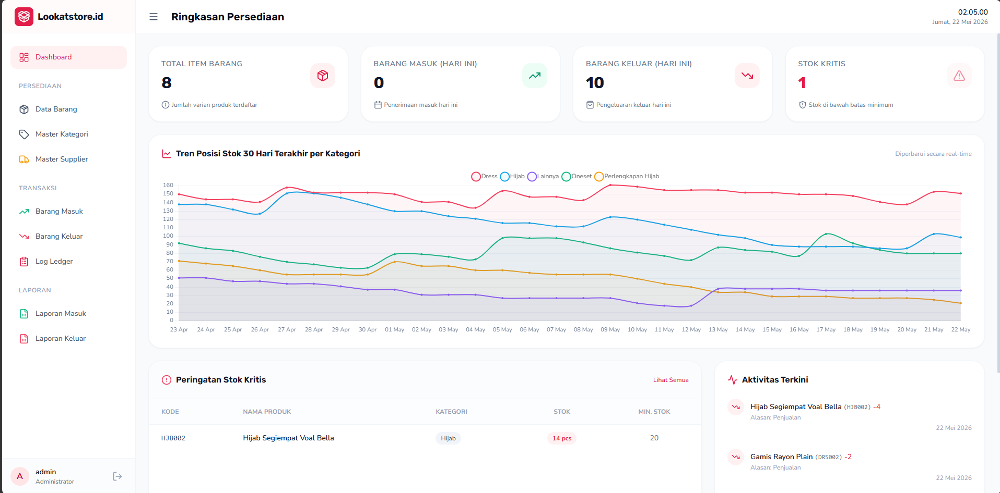
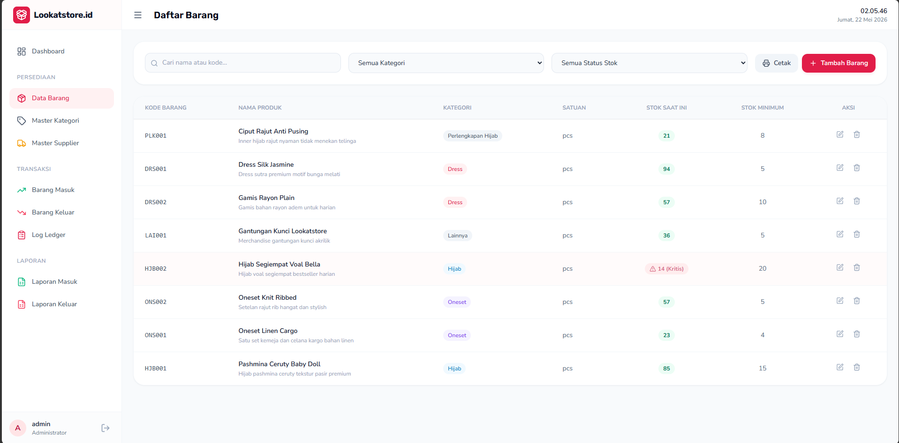
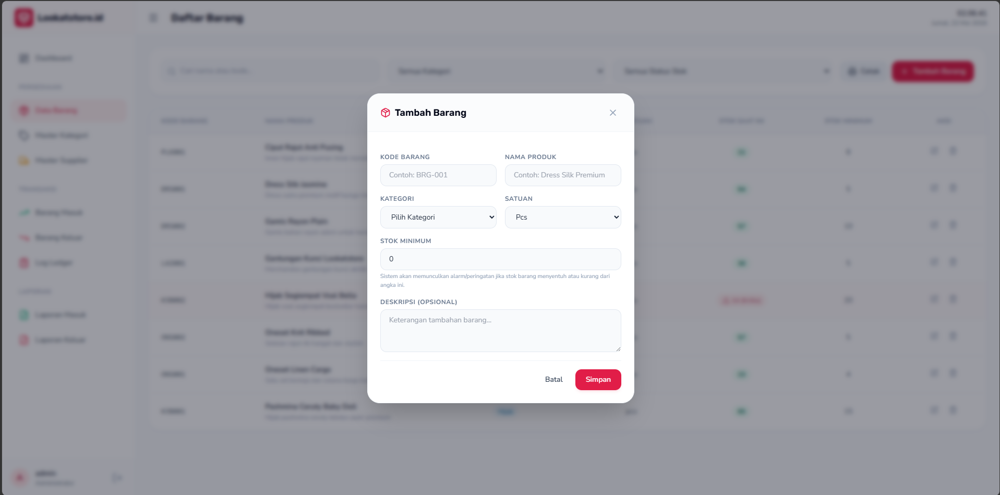
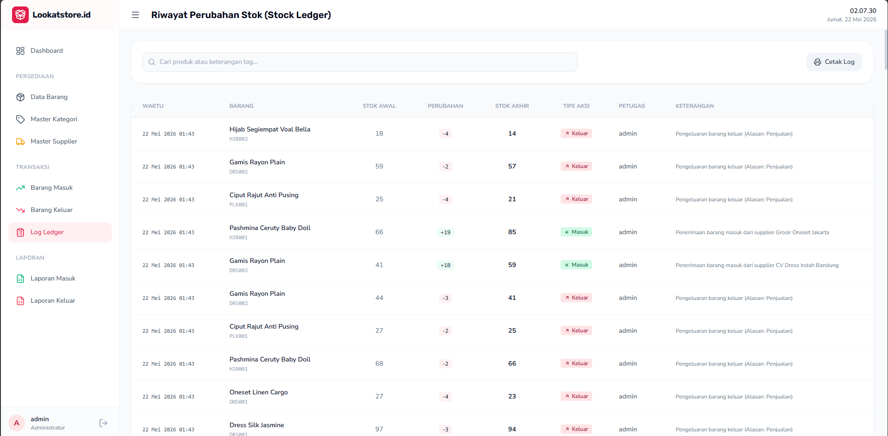
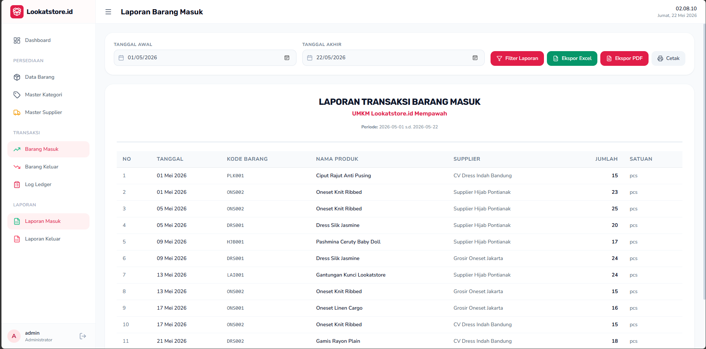
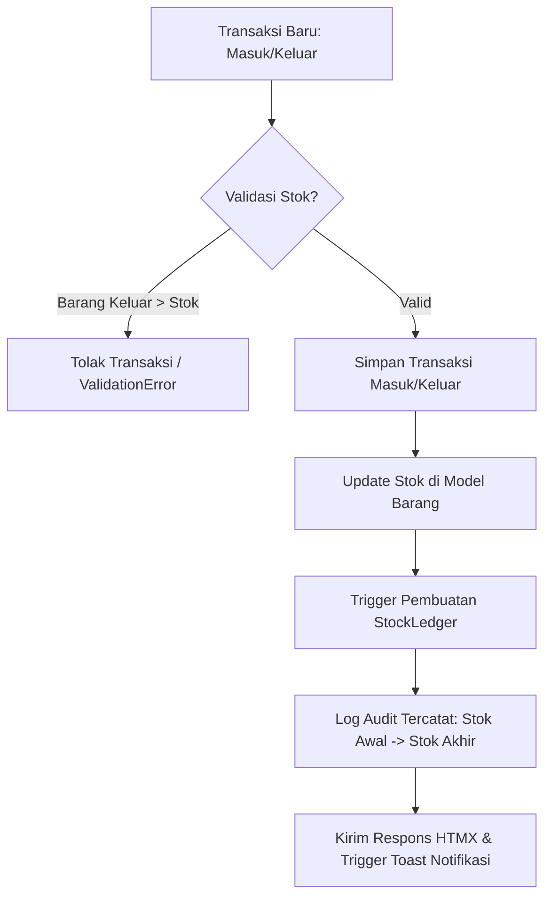

# Lookatstore.id Inventory System 📦✨

Sistem Informasi Manajemen Persediaan Barang berbasis Web untuk **UMKM Lookatstore.id Mempawah** (Boutique Fashion Wanita: Dress, Oneset, Hijab, dan Perlengkapan Hijab). Sistem ini dirancang untuk mendigitalisasi proses pencatatan manual menjadi sistematis, real-time, akuntabel, dan ramah pengguna guna mendukung pengambilan keputusan pemilik usaha.

---

## 🖼️ Galeri Tampilan Aplikasi (Screenshots)

*Catatan: Gambar di bawah ini adalah representasi antarmuka aplikasi. Anda dapat menyimpan file tangkapan layar (screenshot) asli ke dalam folder bernama `screenshots/` di direktori proyek ini secara manual untuk menampilkannya di halaman README ini.*

### 1. Halaman Dashboard Utama
Halaman setelah login yang memuat ringkasan stok, alert stok kritis, aktivitas transaksi terkini, serta grafik tren stok per kategori pakaian selama 30 hari terakhir.


### 2. Manajemen Master Data (Modal Pop-Up CRUD)
Tampilan daftar barang dengan pemanfaatan HTMX Modal untuk operasi tambah dan edit produk tanpa reload halaman.



### 3. Log Riwayat Perubahan Stok (Stock Ledger)
Tabel log audit audit trail yang melacak mutasi stok lengkap dengan catatan user pengubah, jumlah sebelum & sesudah transaksi, dan tanggal pencatatan.


### 4. Laporan & Ekspor (Cetak, Excel, dan PDF)
Antarmuka laporan barang masuk/keluar yang mendukung filter tanggal, format ramah cetak, serta tombol unduh file Excel (.xlsx) dan PDF (.pdf).


---

## 🚀 Fitur & Fungsionalitas Utama

Sistem informasi ini dilengkapi dengan fitur premium modern yang dirancang untuk mendukung operasional harian UMKM:

### 1. 📊 Dashboard Interaktif & Visualisasi
* **Statistik Cepat:** Menampilkan total produk, barang masuk hari ini, barang keluar hari ini, serta jumlah produk dengan kondisi stok kritis.
* **Tren Stok 30 Hari (Chart.js):** Grafik garis interaktif yang merekonstruksi data stok harian per kategori produk selama 30 hari terakhir.
* **Alert Stok Kritis:** Notifikasi visual instan untuk produk yang jumlah stoknya berada di bawah batas minimum (`stok_minimum`).
* **Aktivitas Terkini:** Ringkasan log transaksi masuk/keluar terbaru dengan penanda warna (badge hijau untuk masuk, merah untuk keluar).

### 2. 🗂️ Manajemen Master Data (CRUD Asynchronous via HTMX)
* **Data Kategori:** Pengelolaan kategori pakaian (Dress, Oneset, Hijab, dll.) dengan pop-up modal dinamis.
* **Data Supplier:** Pencatatan pemasok barang lengkap dengan nama, nomor telepon/WhatsApp, email, dan alamat.
* **Data Barang:** Pengelolaan detail produk yang mencakup kode barang unik, nama produk, kategori, satuan, stok saat ini, dan batas minimum stok.

### 3. 🔄 Transaksi Barang Masuk & Keluar
* **Barang Masuk:** Pencatatan penerimaan stok dari supplier tertentu. Otomatis menambah jumlah stok barang bersangkutan.
* **Barang Keluar:** Pencatatan pengeluaran barang (penjualan atau lainnya). Otomatis mengurangi jumlah stok barang bersangkutan.
* **Proteksi Validasi Anti-Negatif:** Sistem menolak transaksi keluar jika jumlah yang diminta melebihi stok yang tersedia (mencegah stok minus di database).
* **Autofill Cerdas:** Form pengeditan mendeteksi dan mempertahankan tanggal transaksi sebelumnya secara aman.

### 4. 📜 Log Riwayat Stok (Stock Ledger / Audit Trail)
* **Jejak Audit Otomatis:** Setiap penambahan, pengeditan, atau penghapusan barang masuk/keluar secara otomatis direkam ke dalam tabel Ledger.
* **Pelacakan Detail:** Mencatat siapa administrator yang mengubah data, kapan diubah, stok awal, stok akhir, selisih perubahan (`perubahan`), tipe transaksi, dan keterangan audit lengkap.

### 5. 📄 Laporan & Ekspor Dokumen
* **Ekspor Excel (`.xlsx`):** Menghasilkan file Excel profesional menggunakan `openpyxl` dengan tema warna khusus, border, lebar kolom otomatis, format angka, dan gaya zebra style.
* **Ekspor PDF (`.pdf`):** Menghasilkan dokumen cetak resmi menggunakan `reportlab` dengan layout clean, kop surat, tabel data dengan fitur wrap-text otomatis, serta lembar tanda tangan pimpinan.
* **Filter Periode:** Ekspor dan pencarian laporan mematuhi rentang tanggal dan kata kunci filter yang sedang aktif di UI.

### 6. 📱 Navigasi Responsif & Collapsible Sidebar
* **Desktop Collapsible:** Sidebar samping dapat diperkecil menjadi ringkas (hanya menampilkan ikon dengan tooltip hover) dan statusnya disimpan di `localStorage` (mencegah layout berkedip/FOUC saat reload).
* **Mobile Drawer:** Panel navigasi samping otomatis bertransformasi menjadi laci geser (off-canvas drawer) dengan efek *backdrop blur* yang ramah perangkat layar sentuh.

---

## 🛠️ Teknologi & Dependensi

* **Backend Framework:** Django 6.0.5 (Python 3.12+)
* **Database:** PostgreSQL (Adapter: `psycopg` & `psycopg-binary`)
* **Styling (CSS):** Tailwind CSS via CDN (Boutique Slate/Rose styling)
* **Interaktivitas & AJAX:** HTMX 1.9.10 (untuk CRUD modal tanpa reload halaman)
* **Ikonografi:** Lucide Icons (Render dinamis & integrasi HTMX)
* **Grafik:** Chart.js (Line chart responsif)
* **Pustaka Ekspor:** `openpyxl` (Excel) & `reportlab` (PDF)

---

## 🔄 Alur & Cara Kerja Sistem

### 1. Alur Logika Bisnis Persediaan


### 2. Penjelasan Cara Kerja Integrasi HTMX
* Ketika tombol **Tambah** atau **Ubah** diklik, HTMX memanggil view Django secara asynchronous (`hx-get`).
* Django merender potongan HTML template form dan memasukkannya ke dalam kontainer `#modal-container`.
* Saat form dikirimkan (`hx-post`), Django memproses form tersebut. Jika sukses, Django akan mengembalikan header `HX-Trigger` yang berisi instruksi untuk memicu event pembaruan tabel (misal: `barangListChanged`) dan memicu toast notification (`showToast`).
* Halaman utama menangkap event tersebut secara instan untuk memperbarui isi tabel secara parsial dan memunculkan toast banner di kanan atas layar tanpa perlu memuat ulang seluruh halaman.

---

## 💻 Panduan Instalasi & Menjalankan Aplikasi

Ikuti langkah-langkah di bawah ini untuk menginstal dan menjalankan proyek dari awal di komputer lokal Anda (panduan ditulis untuk sistem operasi **Windows**):

### Langkah 1: Instalasi Software Pendukung
Pastikan komputer Anda sudah terpasang:
1. **Python 3.12+** (Centang pilihan *"Add Python to PATH"* saat instalasi).
2. **PostgreSQL Database Server** (Bisa diunduh di website resmi PostgreSQL).

### Langkah 2: Setup Database PostgreSQL
1. Buka aplikasi **pgAdmin** atau buka terminal PostgreSQL CLI (psql).
2. Buat sebuah database baru dengan nama `db_lookatstore`:
   ```sql
   CREATE DATABASE db_lookatstore;
   ```
3. Pastikan username PostgreSQL Anda adalah `postgres` dengan password `admin123`, atau Anda dapat mengubah konfigurasi koneksi database di file `lookatstore_inventory/settings.py` sesuai kredensial server PostgreSQL Anda.

### Langkah 3: Siapkan Virtual Environment (venv)
1. Buka PowerShell atau Command Prompt pada direktori proyek Anda (`lookatstore-inventory`):
   ```powershell
   # Membuat virtual environment baru bernama 'env'
   python -m venv env
   ```
2. Aktifkan virtual environment tersebut:
   ```powershell
   # Windows PowerShell
   .\env\Scripts\Activate.ps1
   
   # Windows CMD
   .\env\Scripts\activate.bat
   ```

### Langkah 4: Instalasi Dependensi
Pastikan Virtual Environment (`env`) Anda dalam keadaan aktif (ditandai dengan tulisan `(env)` di awal prompt baris perintah), lalu instal paket Python yang dibutuhkan:
```powershell
# Menginstal library pendukung dari requirements.txt
pip install -r requirements.txt

# Memastikan adapter database PostgreSQL terinstal dengan benar
pip install psycopg[binary]
```

### Langkah 5: Migrasi Database (Database Migration)
Terapkan struktur tabel model Django ke database PostgreSQL Anda:
```powershell
# Membuat berkas migrasi
python manage.py makemigrations

# Menerapkan migrasi ke database PostgreSQL
python manage.py migrate
```

### Langkah 6: Mengisi Data Demo / Awal (Seeding Data)
Jalankan script otomatis untuk mengisi data awal (Supplier, Kategori, Produk, dan transaksi historis 30 hari) agar sistem langsung siap didemokan dengan grafik yang terisi penuh:
```powershell
python scratch/seed_data.py
```
*(Script ini juga otomatis memastikan akun administrator default siap digunakan).*

### Langkah 7: Membuat Akun Administrator Tambahan (Opsional)
Jika Anda ingin membuat akun superuser tambahan secara manual:
```powershell
python manage.py createsuperuser
```
Masukkan username, email (opsional), dan password sesuai petunjuk di layar.

### Langkah 8: Menjalankan Server Lokal (Development Server)
Jalankan server Django:
```powershell
python manage.py runserver
```
Buka browser Anda dan akses aplikasi melalui alamat:
👉 **[http://127.0.0.1:8000/](http://127.0.0.1:8000/)**

* **Akun Login Bawaan (Hasil Seeding):**
  * **Username:** `admin`
  * **Password:** `adminpassword123`

---


